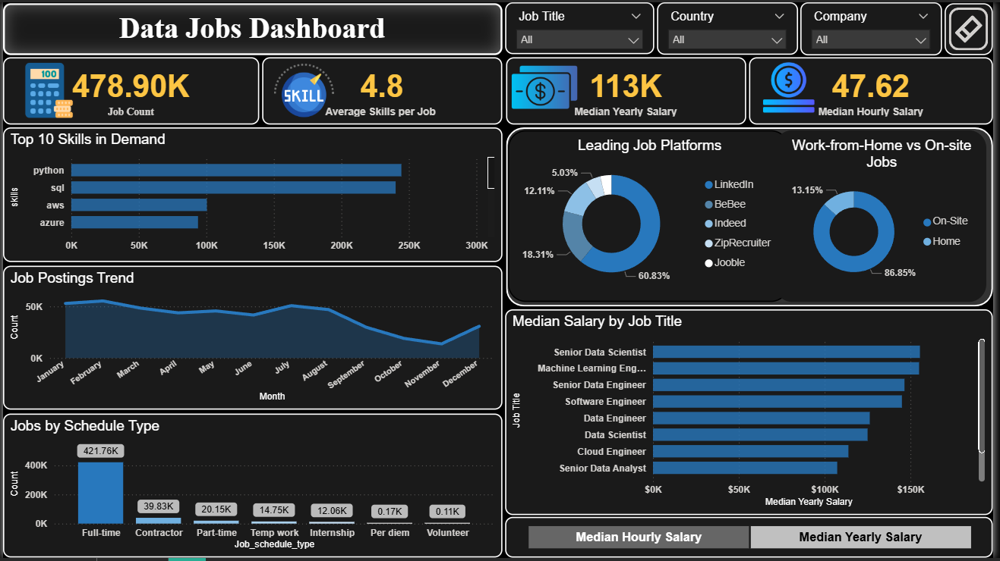

# 📊 Data Jobs Dashboard – Power BI Project

This repository contains my **Data Jobs Dashboard**, built using **Power BI** to analyze **global job market trends**.  
The dashboard explores **skills in demand, job postings, salary insights, and job platforms**, helping job seekers and recruiters understand the current hiring landscape.

---

## **✨ Dashboard Highlights**
- **478K+ Job Postings** analyzed across major job platforms.
- **Top 10 Skills in Demand** – Python, SQL, AWS, Azure dominate the market.
- **Key Metrics (KPIs):**
  - Total Job Count  
  - Average Skills per Job (4.8)  
  - Median Yearly Salary (113K)  
  - Median Hourly Salary (47.62)  
- **Work-from-Home vs On-Site Jobs** distribution.  
- **Job Posting Trends** – Month-over-month hiring activity.  
- **Jobs by Schedule Type** – Full-time, Contract, Part-time, Internships, etc.  
- **Median Salary by Job Title** – Insights into Data Scientist, Data Engineer, Business Analyst, and other roles.  
- **Interactive Filters:** Job Title, Country, Company (Top 25 entities).  

---

## **🛠 Tools & Technologies**
- **Power BI** – Data modeling, DAX measures, and interactive visualizations.  
- **Data Modeling** – Fact & dimension tables (job postings, companies, skills).  
- **Top N Filtering & Slicers** – For dynamic skill and company insights.  
- **Custom Design:** Dark theme with modern KPI icons for a professional look.

---

## **📷 Dashboard Preview**

---

## **📈 Key Insights from the Dashboard**
- **Python** and **SQL** are the most in-demand skills, dominating the job market.  
- **LinkedIn** is the leading job platform (60%+ share).  
- **Full-time roles** represent the majority of job postings (420K+).  
- **Senior Data Scientist and Machine Learning Engineer** roles offer top salaries (up to $150K/year).  
- **Work-from-home jobs** account for only 13% of postings, with on-site being dominant. 

---

